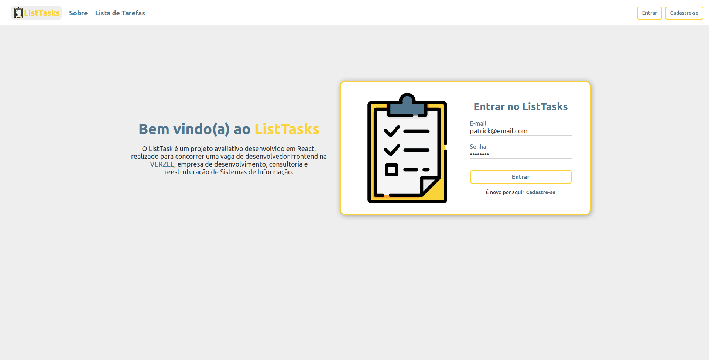
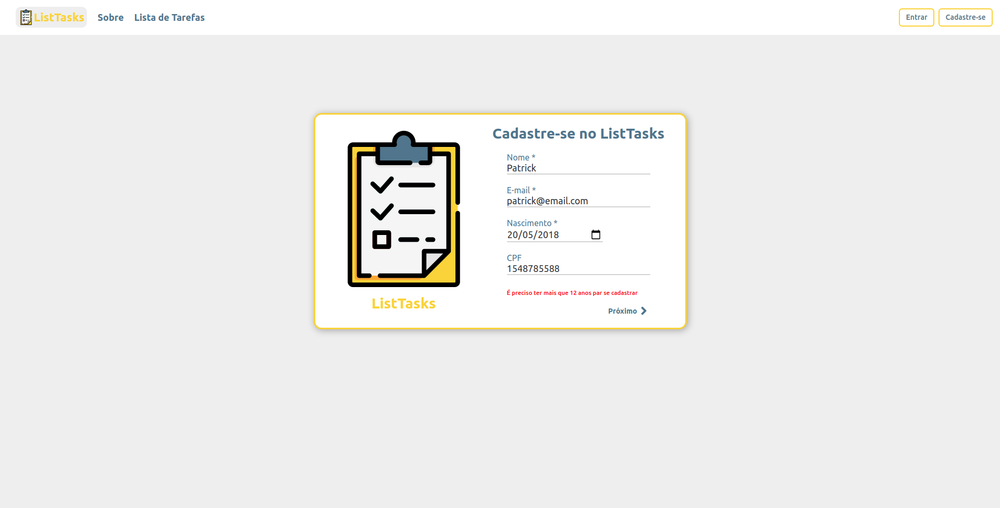
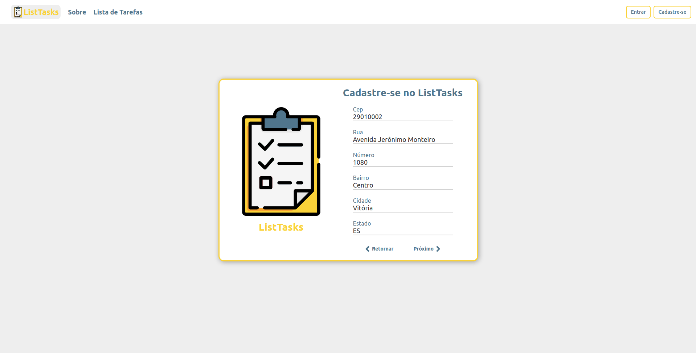
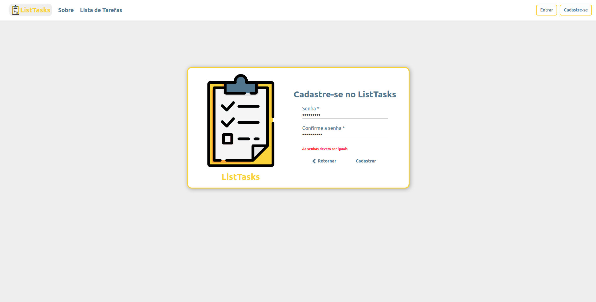
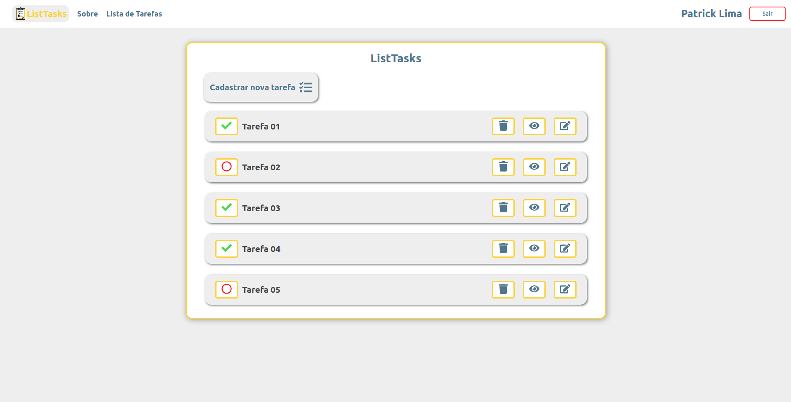
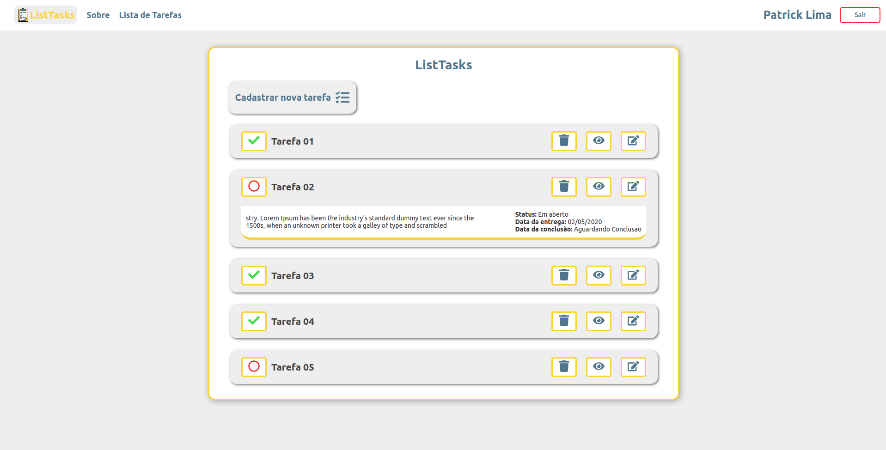
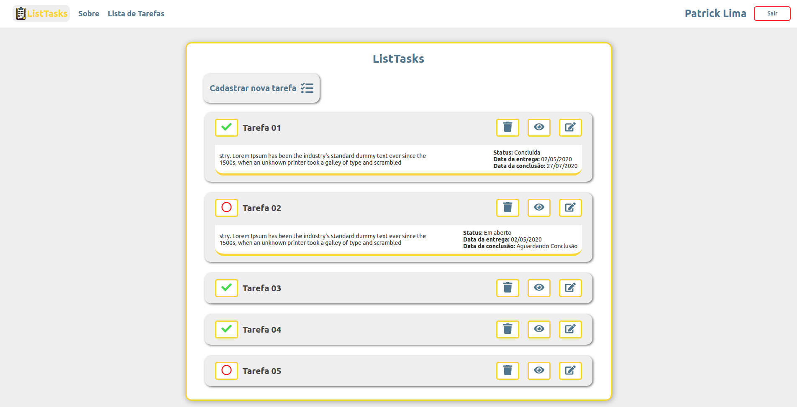
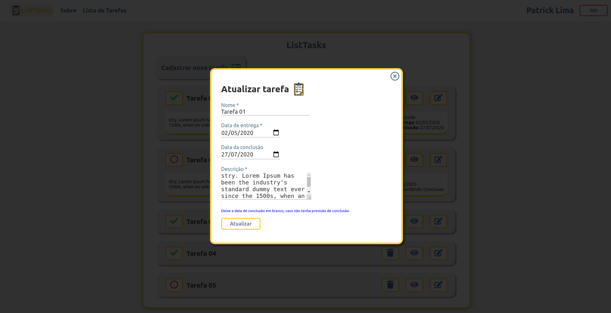
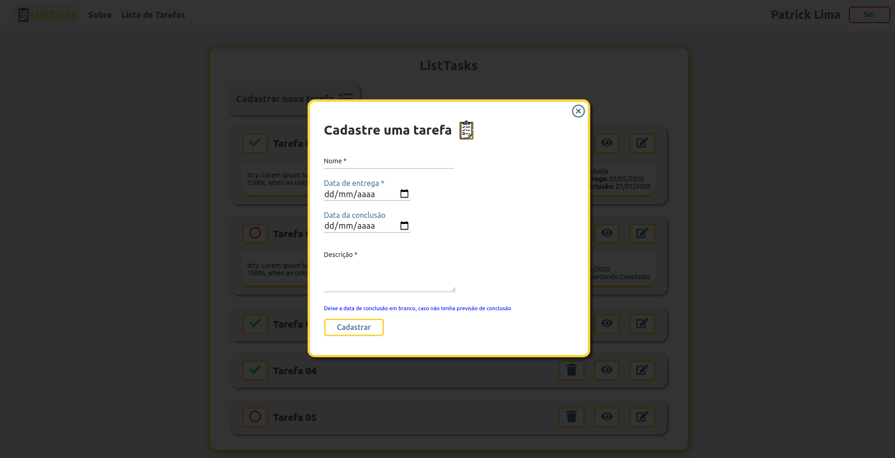

# **ListTasks**


### Teste técnico, desenvolvido em React JS para fazer parte do time de desenvovedores da [VERXZEL](https://pt-br.reactjs.org/) 
### O desafio deste teste, do qual eu nomeei de **ListTasks**, consiste em desenvolver uma aplicação web que permitirá o usuário se cadastrar, realizar login e gerenciar tarefas, como inserir, remover, listar mudar o status da tarefa (concluída ou não concluída). 


</br>


# Requisitos funcionais da aplicação

* Criar página de login
  * Usuário deverá logar com email e senha.
* Criar página de Cadastro
  * Permitir que o usuário se cadastre com nome, email, data de nascimento e senha como
  campos obrigatórios, cpf e endereço opcionais
  * Permitir apenas usuário com idade maior que 12 anos
  * Validar CPF
  * Auto complete dos campos do endereço ao inserir o CEP
* Criar página de lista de tarefas
  * Permitir que o usuário adcione novas tarefas
  * Permitir que o usuário remova tarefas
  * Permitir que o usuário atualize as tarefas
  * Permitir que o usuário visualize a tarefa
  * Permitir que o usuário atualize o status das tarefas (concluida ou não concluida)
  
<br>

# Requisitos não funcionais da aplicação

* Utilizar React JS
* Utilizar Redux
* Utilizar Redux Persist

<br>

# Tecnologias utilizadas


### Nesta aplicação, proucurei utilizar os recursos mais atualizados e estáveis do ecossistema React, segue abaixo as principais dependências instaladas:


````JSON
dependencies {
  "axios": "^0.19.2",
  "date-fns": "^2.15.0",
  "immer": "^7.0.7",
  "prop-types": "^15.7.2",
  "react-icons": "^3.10.0",
  "react-redux": "^7.2.0",
  "react-router-dom": "^5.2.0",
  "redux": "^4.0.5",
  "redux-persist": "^6.0.0",
  "styled-components": "^5.1.1",
  "uuidv4": "^6.2.0",
  "yup": "^0.29.1",

},
devDependencies: {
    "eslint": "6.6.0",
    "eslint-config-prettier": "^6.11.0",
    "eslint-plugin-prettier": "^3.1.4",
    "json-server": "^0.16.1",
    "prettier": "^2.0.5"
}

````

  ## Estilização dos componentes

 #### Optei por utilizar o `styled-componets/native`, para estilizar meus componentes, considerando a facilidade que ele nos dar em inplementar variáveis e funções na estilização.

<br>


# **Requisitos para instalar e executar a aplicação em ambiente de desenvolvimento:**

  * Node instalado
  * NPM ou YARN instalado

### Para executar o App é necessário instalar as depedencias do _package.json_
  Como nesse app eu utilizei o `YARN`, irei ilustra os comandos com o mesmo.

## Instalar dependências:
```bash
yarn install
```
## Iniciar a execução da Aplicação Web:
```bash
yarn start
```
## Iniciar a API _fake_:
```bash
yarn json-server server.json -p 3333 -w 
```

</br>

# Estrutura principal da aplicação
- `src/index.js` -> Arquivo raiz principal da aplicação que contem o `ReactDOM.render`
- `src/App.js` -> Componente inicial do qual direciona para as rotas
- `src/pages/` -> Pasta que contem os arquivos de páginas do projeto como (Login, Cadastro e Lista de Tarefas)
- `src/components/` -> Pasta que contém os componentes de apoio que são utilizados em mais de uma tela ou que são apenas de visualização (Input, Header, Modal)
- `src/store` -> Pasta que contem arquivo de configuraça, store e modules do Redux
- `src/routes` -> Pasta que contem as rotas principais da aplicação
- `src/services` -> Pasta que contem arquivos de configuração de APIs externas
- `src/assets/` -> Pasta que contem arquivos acessiveis státicos como imagens 
- `src/utils` -> Arquivos úteis com funções expecíficas como validação de CEP, CPF e data de nascimento.
  
</br>

<h1 align="center">

 **Screenshots da aplicação**

</h1>



---



---



---



---



---



---



---



---



---
